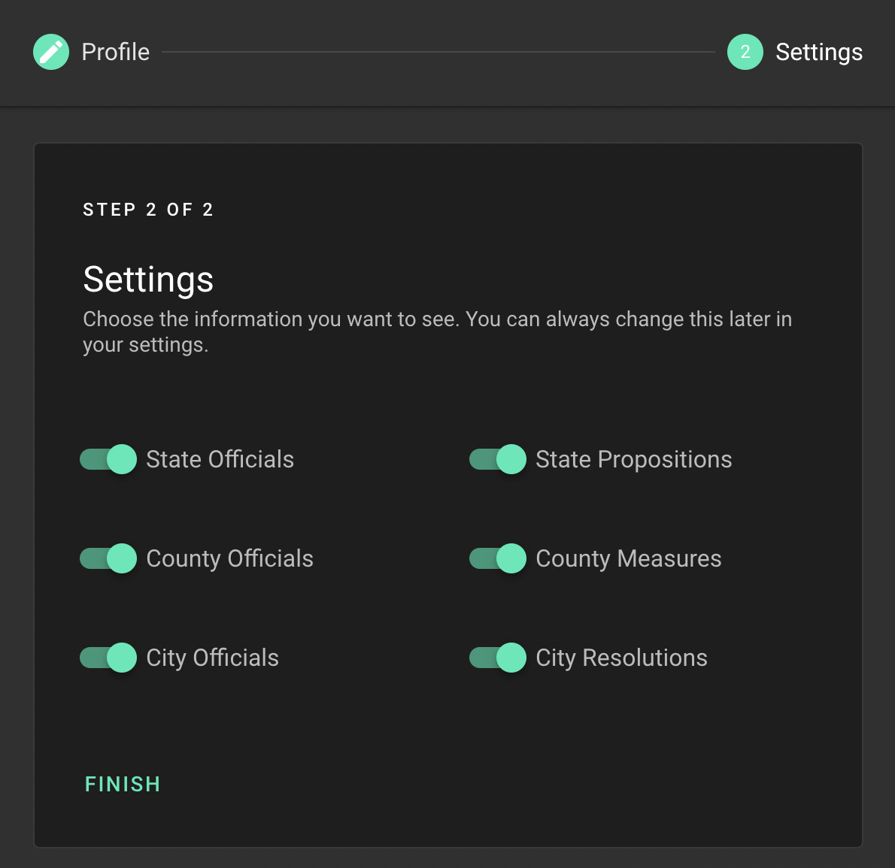

# CivAssist

Web app and Facebook Messenger chatbot which increases civic engagement in American communities by providing easy access to information about county, state, and federal officials and their policies.

Messenger chatbot can be found [here](http://m.me/civassist). Currently offline.

Used Nuxt/Vue, NodeJS, Firebase, Heroku, FB Messenger API, and JS. Can be found at [civic-hacks.herokuapp.com](https://civic-hacks.herokuapp.com/) until free plans are [shut down on November 28, 2022](https://blog.heroku.com/next-chapter).

## Images

### Web app

<p align="center">
    
</p>
<p align="center">
    
    
</p>
<p align="center">
    
</p>
<p align="center">
    
</p>


### Chatbot

<p align="center">
    
    
</p>


## Video

View our hackathon submission video [here](https://drive.google.com/file/d/1vOZhapSrkVRof1fYXML-cAx_EEdOuE7V/preview)!


## Build Setup

```bash
# install dependencies
$ npm install

# serve with hot reload at localhost:3000
$ npm run dev

# build for production and launch server
$ npm run build
$ npm run start

# generate static project
$ npm run generate
```

For detailed explanation on how things work, check out [Nuxt.js docs](https://nuxtjs.org).

Used Vuetify's Parallax Template and Creative Tim's Dashboard Template

## Contributors

Hackathon project by [Joe Lin](https://github.com/joe-lin-tech/hackathon) and [Rohil Shah](https://github.com/rohildshah).